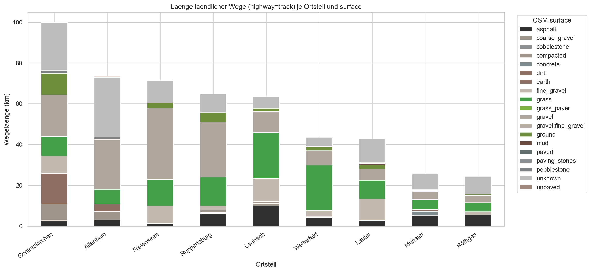

# Results and Outputs

## What Is OSM vs What Is Classification

- OSM direct in outputs:
	- geometry references and OSM metadata fields (`osm_id`, `osm_surface`, `osm_tracktype`)
- Sentinel-derived in outputs:
	- feature variables from EO processing (stored in the feature table)
- Classification output in outputs:
	- `class_label`, confidence, and probabilities generated by the ML model

Therefore, the classified GeoPackages represent model inference, not raw OSM tagging.

### Exact Attribute Provenance in Classified GeoPackages

Verified from the exported layers:
- `classification_outputs/laubach_feldwege_klassifiziert_buffer.gpkg` (layer `feldwege_buffer`)
- `classification_outputs/laubach_feldwege_klassifiziert_linien.gpkg` (layer `feldwege`)

| Attribute | Provenance |
|---|---|
| osm_id | OSM direct |
| highway | OSM direct |
| surface | OSM direct |
| tracktype | OSM direct |
| name | OSM direct |
| osm_surface | OSM direct (normalized helper field) |
| osm_tracktype | OSM direct (normalized helper field) |
| class_id | Model output |
| class_label | Model output |
| confidence | Model output (maximum class probability) |
| prob_versiegelt | Model output probability |
| prob_mineralisch | Model output probability |
| prob_begrünt_erdig | Model output probability |
| geometry | OSM-derived geometry |

Important:
- Raw Sentinel features are not stored in the final classified GeoPackages.
- Sentinel-derived feature columns (`NDVI_*`, `NDWI_*`, `NDBI_*`, `VV_*`, `VH_*`) are in `openeo_outputs/laubach_feature_table.csv`.

## Model Artifacts

Generated model files:
- classification_outputs/random_forest_laubach.joblib
- classification_outputs/gradient_boosting_laubach.joblib

Evaluation visuals:
- classification_outputs/confusion_matrix.png
- classification_outputs/feature_importance.png

## GIS Deliverables

Classified layers:
- classification_outputs/laubach_feldwege_klassifiziert_linien.gpkg
- classification_outputs/laubach_feldwege_klassifiziert_buffer.gpkg

Tabular predictions:
- classification_outputs/laubach_prediction_table.csv

Styling:
- classification_outputs/feldwege_klassifikation.sld

## QGIS Distribution

Project and package:
- laubach_feldwege.qgs
- laubach_qgis_package.zip

This enables direct viewing and handover in GIS teams without rebuilding the pipeline.

## Current Performance Note

The pipeline is technically stable and reproducible.
Model performance is currently limited by weak-label quality and should be improved with validated training data.

## Key Bar Chart: Rural Road Length by Community and Road Type

The key stacked bar chart for the municipal comparison is shown below.

Data source for this chart:
- `analysis_outputs/laubach_35321_admin/laubach_35321_length_by_community_highway.csv`
